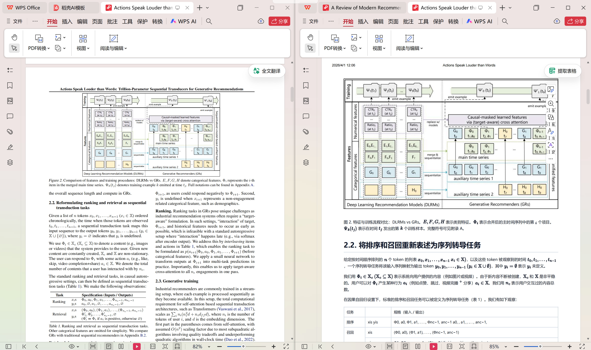

# MinerU PDF Translate

English | [简体中文](README.zh-CN.md)

`mineru-pdf-translate` is a ready-to-use Codex skill and standalone Python script that translates local PDF documents into PDFs in a target language.

## Demo



The end-to-end workflow:

1. Parse the PDF with the MinerU online API.
2. Translate the extracted Markdown with an OpenAI-compatible API.
3. Render the translation back into a final PDF through headless browser printing.

The project is designed for research papers, technical documents, and similar content. Its output is a translated PDF with figures and formulas preserved, rather than intermediate Markdown alone.

## Features

- Batch-process PDFs in a specified directory
- Extract document structure and image references with MinerU
- Translate Markdown with an OpenAI-compatible model
- Protect image references during translation so links remain intact
- Render formulas with MathJax
- Produce final PDFs with Edge, Chrome, or Chromium

## Repository Structure

```text
.
|-- LICENSE
|-- README.md
|-- README.zh-CN.md
|-- mineru-pdf-translate/
|   |-- SKILL.md
|   |-- agents/
|   |   `-- openai.yaml
|   `-- scripts/
|       |-- pdf_translate.py
|       |-- source_evidence.py
|       `-- render_pdf.cjs
`-- 361d25f9-c585-4067-b550-f346dc3a0e9f.png
```

## Requirements

- Python 3.10 or later; source comparison requires `PyMuPDF` (`python -m pip install PyMuPDF`).
- Node.js and the `playwright` package. Codex bundled dependencies are discovered automatically; elsewhere use `npm install playwright` and an existing browser.
- Microsoft Edge, Google Chrome, or Chromium for headless PDF printing on Windows, macOS, or Linux.
- A MinerU API token.
- An OpenAI-compatible base URL and API key.

If the Python `markdown` package is missing, the script installs it automatically.

## Quick Start

### Option 1: Use as a Codex skill

Copy the `mineru-pdf-translate/` directory into the Codex skills directory. For example, in PowerShell:

```powershell
Copy-Item -Recurse .\mineru-pdf-translate $HOME\.codex\skills\mineru-pdf-translate
```

Then invoke the skill in Codex for a directory containing PDF files.

### Option 2: Run the script directly

From the directory containing the PDFs to translate, run:

```powershell
python <repo-dir>\mineru-pdf-translate\scripts\pdf_translate.py --workdir .
```

For example:

```powershell
python C:\path\to\mineru-pdf-translate\mineru-pdf-translate\scripts\pdf_translate.py --workdir .
```

## Configuration

The script first looks for local configuration files in the working directory. If they are absent, it falls back to environment variables.

### Local configuration files

Create the following files in the directory containing the PDFs:

1. `mineru密钥.txt`
   Content: MinerU API token.
2. `翻译大模型url以及key.txt`
   Line 1: OpenAI-compatible base URL.
   Line 2: API key.

A combined `大模型和mineru的key.txt` file is also supported, with labelled `model:`, `url:`, `key:` and `mineru:` fields; values may be on the next line. Choose a model supporting image input for automatic OCR correction.

### Environment variables

Alternatively, configure the pipeline with environment variables:

```powershell
$env:MINERU_API_TOKEN="your_mineru_token"
$env:PDF_TRANSLATE_LLM_BASE_URL="https://your-api-base-url"
$env:PDF_TRANSLATE_LLM_API_KEY="your_api_key"
$env:PDF_TRANSLATE_MODEL="gpt-5.4-mini"
$env:PDF_TRANSLATE_BROWSER="C:\Program Files\Google\Chrome\Application\chrome.exe"
```

`PDF_TRANSLATE_MODEL` and `PDF_TRANSLATE_BROWSER` are optional. The default model is `gpt-5.4-mini`.

## Usage Examples

Translate every PDF in the current directory into Simplified Chinese:

```powershell
python <skill-dir>\scripts\pdf_translate.py --workdir .
```

Discard cached parsing and translation results and rebuild every output:

```powershell
python <skill-dir>\scripts\pdf_translate.py --workdir . --force
```

Re-render PDFs from cached translated Markdown after changing only the rendering styles:

```powershell
python <skill-dir>\scripts\pdf_translate.py --workdir . --render-only --keep-temp
```

Translate into another language and choose a custom output suffix:

```powershell
python <skill-dir>\scripts\pdf_translate.py --workdir . --target-language "Japanese" --target-suffix ja
```

Pass API settings directly on the command line:

```powershell
python <skill-dir>\scripts\pdf_translate.py `
  --workdir . `
  --mineru-token "your_mineru_token" `
  --llm-base-url "https://your-api-base-url" `
  --llm-api-key "your_api_key" `
  --llm-model "gpt-5.4-mini"
```

## Main Options

- `--workdir`: Directory containing the input PDFs and optional local configuration files.
- `--output-dir`: Final PDF output directory. Defaults to `translated`.
- `--temp-dir`: Temporary folder inside the workdir, separate from the output directory. Defaults to `.pdf_translate_tmp`.
- `--target-language`: Translation target language. Defaults to `Simplified Chinese`.
- `--target-suffix`: Output filename suffix. Defaults to `zh`.
- `--source-language`: Source language hint sent to MinerU. Defaults to `en`.
- `--mineru-token`: Override the MinerU API token.
- `--llm-base-url`: Override the OpenAI-compatible base URL.
- `--llm-api-key`: Override the OpenAI-compatible API key.
- `--llm-model`: Select the model name.
- `--browser-path`: Set the Edge, Chrome, or Chromium executable path.
- `--upload-api-url`: Defaults to `mineru` for direct MinerU storage upload. A tmpfiles-compatible upload endpoint may also be supplied.
- `--force`: Discard cached parsing and translation results and rerun the complete pipeline.
- `--render-only`: Skip MinerU and the LLM, then render a PDF from cached translated Markdown. Use with `--keep-temp`.
- `--keep-temp`: Retain temporary files after a successful run.
- `--ocr-correction auto`: Compare formulas and tables to original PDF crops during translation (default); `off` disables source comparison.
- `--workers 3`: Concurrent translation requests.

## Resumable Processing

Intermediate files in the temporary directory also serve as stage-level caches:

- An existing `mineru/full.md` skips MinerU parsing.
- A translation skips model calls only when source, model, endpoint, target language and correction mode match.
- Each successful chunk is cached separately; interrupted runs retry unfinished chunks.
- MinerU task IDs survive upload, polling and download failures.
- The temporary directory is retained after failures. Rerun the same command after fixing the problem to resume from the last completed stage.
- Use `--force` for a full rerun, or `--render-only` when only rendering needs to be repeated.

## Output

- Final translated PDFs are written to `translated/`.
- Temporary files are written to `.pdf_translate_tmp/`.
- If any documents fail, details are written to `.pdf_translate_tmp/failures.json`.

Output filenames follow this pattern:

```text
original_name_<target-suffix>.pdf
```

For example:

```text
paper_zh.pdf
```

## Processing Pipeline

For each PDF, the script:

1. Uploads the PDF directly to MinerU storage and creates a parsing task by default. A temporary hosting service can be configured instead.
2. Polls MinerU until parsing completes.
3. Downloads the ZIP result returned by MinerU.
4. Locates `full.md` in the extracted result.
5. Protects formulas, tables, images and code blocks; translates chunks while comparing OCR against original formula/table crops.
6. Renders the translated Markdown as HTML.
7. Waits for fonts, images and MathJax, validates rendering, then replaces the final PDF only after successful printing.

Each stage is cached in the temporary directory, so reruns automatically skip completed work.

## Notes

- Direct MinerU upload is the default (`--upload-api-url mineru`), so PDFs do not pass through a third-party temporary file host.
- To use temporary hosting, pass `--upload-api-url https://tmpfiles.org/api/v1/upload` or another compatible endpoint.
- The script scans only top-level `*.pdf` files in the working directory.
- Generated `_zh.pdf` files are excluded from subsequent input scans.
- Confirmed formulas render through MathJax v3. Uncertain or invalid corrections and formula rendering errors fall back to original PDF crops.
- Local images are embedded and short temporary rendering paths avoid Windows image-loading failures.
- Correction targets OCR transcription, not the author's mathematics or experimental conclusions. Complex material still merits source comparison; no separate QA report is generated.
- HTML rendering loads MathJax from a CDN and therefore requires network access.
- Place an `ocr_repairs.json` file in the working directory to add document-specific OCR repair mappings. The file must contain a JSON object that maps source strings to replacement text.

## Use Cases

- Research paper translation
- Technical documentation translation
- Batch translation of local PDFs
- Workflows that require a final translated PDF instead of intermediate Markdown alone

## License

This project is licensed under the [MIT License](LICENSE).
