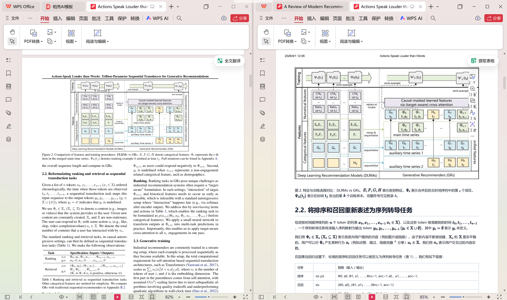

# MinerU PDF Translate

[English](README.md) | 简体中文

`mineru-pdf-translate` 是一个可直接用于 Codex 的 skill，同时也包含一个可以独立运行的 Python 脚本，用来把本地 PDF 文档翻译成目标语言 PDF。

## 效果展示



整体流程是：

1. 调用 MinerU 在线解析 PDF
2. 使用 OpenAI 兼容接口翻译提取出的 Markdown
3. 通过浏览器无头打印，把译文重新渲染成最终 PDF

它适合论文、技术文档等场景，目标产物是带图片、带公式的最终译文 PDF，而不是中间 Markdown。

## 功能特性

- 批量处理指定目录下的 PDF 文件
- 使用 MinerU 提取文档结构和图片引用
- 使用 OpenAI 兼容模型翻译 Markdown 内容
- 在翻译过程中保护图片引用，避免链接被破坏
- 使用 MathJax 渲染公式
- 使用 Edge / Chrome / Chromium 输出最终 PDF

## 仓库结构

```text
.
|-- LICENSE
|-- README.md
|-- README.zh-CN.md
|-- mineru-pdf-translate/
|   |-- SKILL.md
|   |-- agents/
|   |   `-- openai.yaml
|   `-- scripts/
|       `-- pdf_translate.py
`-- 361d25f9-c585-4067-b550-f346dc3a0e9f.png
```

## 运行要求

- Python 3.10 或更高版本（仅使用标准库发起网络请求，无需 curl）
- 已安装 Microsoft Edge、Google Chrome 或 Chromium 之一，用于无头打印 PDF（Windows / macOS / Linux 均可）
- 有可用的 MinerU API Token
- 有可用的 OpenAI 兼容接口地址和 API Key

如果本机未安装 `markdown` 包，脚本会自动安装。

## 快速开始

### 方式 1：作为 Codex skill 使用

把仓库里的 `mineru-pdf-translate/` 目录放到 Codex 的 skills 目录，例如：

```powershell
Copy-Item -Recurse .\mineru-pdf-translate $HOME\.codex\skills\mineru-pdf-translate
```

然后在 Codex 里针对包含 PDF 的目录调用这个 skill。

### 方式 2：直接运行脚本

在包含待翻译 PDF 的目录中执行：

```powershell
python <repo-dir>\mineru-pdf-translate\scripts\pdf_translate.py --workdir .
```

例如：

```powershell
python C:\path\to\mineru-pdf-translate\mineru-pdf-translate\scripts\pdf_translate.py --workdir .
```

## 配置方式

脚本优先读取工作目录中的本地配置文件；如果这些文件不存在，则回退到环境变量。

### 本地配置文件

在 PDF 所在目录中创建以下文件：

1. `mineru密钥.txt`
   内容：MinerU API Token
2. `翻译大模型url以及key.txt`
   第 1 行：OpenAI 兼容接口 Base URL
   第 2 行：API Key

### 环境变量

也可以改为使用环境变量：

```powershell
$env:MINERU_API_TOKEN="your_mineru_token"
$env:PDF_TRANSLATE_LLM_BASE_URL="https://your-api-base-url"
$env:PDF_TRANSLATE_LLM_API_KEY="your_api_key"
$env:PDF_TRANSLATE_MODEL="gpt-5.4-mini"
$env:PDF_TRANSLATE_BROWSER="C:\Program Files\Google\Chrome\Application\chrome.exe"
```

`PDF_TRANSLATE_MODEL` 与 `PDF_TRANSLATE_BROWSER` 是可选项，模型默认值为 `gpt-5.4-mini`。

## 使用示例

把当前目录中的所有 PDF 翻译成简体中文：

```powershell
python <skill-dir>\scripts\pdf_translate.py --workdir .
```

强制重建已存在的输出文件（同时丢弃缓存的解析与翻译结果）：

```powershell
python <skill-dir>\scripts\pdf_translate.py --workdir . --force
```

只改了渲染样式时，从缓存译文直接重新出 PDF：

```powershell
python <skill-dir>\scripts\pdf_translate.py --workdir . --render-only --keep-temp
```

翻译成其他语言，并自定义输出后缀：

```powershell
python <skill-dir>\scripts\pdf_translate.py --workdir . --target-language "Japanese" --target-suffix ja
```

直接通过命令行指定 API 参数：

```powershell
python <skill-dir>\scripts\pdf_translate.py `
  --workdir . `
  --mineru-token "your_mineru_token" `
  --llm-base-url "https://your-api-base-url" `
  --llm-api-key "your_api_key" `
  --llm-model "gpt-5.4-mini"
```

## 主要参数

- `--workdir`：待处理 PDF 所在目录，同时也是可选配置文件目录
- `--output-dir`：最终 PDF 输出目录，默认是 `translated`
- `--temp-dir`：临时目录，默认是 `.pdf_translate_tmp`
- `--target-language`：目标翻译语言，默认是 `Simplified Chinese`
- `--target-suffix`：输出文件名后缀，默认是 `zh`
- `--source-language`：传给 MinerU 的源文档语言提示，默认是 `en`
- `--mineru-token`：直接覆盖 MinerU Token
- `--llm-base-url`：直接覆盖 OpenAI 兼容接口地址
- `--llm-api-key`：直接覆盖 OpenAI 兼容接口 Key
- `--llm-model`：指定模型名称
- `--browser-path`：手动指定 Edge / Chrome / Chromium 路径
- `--upload-api-url`：默认 `mineru`（直传 MinerU 存储）；也可指定 tmpfiles 兼容上传接口 URL
- `--force`：丢弃缓存的解析与翻译结果，完全重跑
- `--render-only`：跳过 MinerU 和 LLM，直接从缓存的译文 Markdown 重新渲染 PDF（配合 `--keep-temp` 使用）
- `--keep-temp`：保留临时目录，不在结束后清理

## 断点续跑

临时目录中的中间产物同时是各阶段的缓存：

- 已有 `mineru/full.md` 时跳过 MinerU 解析
- 已有 `mineru/translated_<suffix>.md` 时跳过 LLM 翻译
- 运行失败时临时目录自动保留，修复问题后重跑同一命令即可从断点继续
- 想全部重来用 `--force`；只想改渲染样式后重出 PDF 用 `--render-only`

## 输出说明

- 最终译文 PDF 输出到 `translated/`
- 临时文件输出到 `.pdf_translate_tmp/`
- 如果有失败项，会生成 `translated/failures.json`

输出 PDF 文件名格式如下：

```text
original_name_<target-suffix>.pdf
```

例如：

```text
paper_zh.pdf
```

## 处理流程

对每个 PDF，脚本会依次执行：

1. 直传 PDF 到 MinerU 存储并创建解析任务（默认；也可改走临时托管上传）
2. 轮询 MinerU，直到解析完成
3. 下载 MinerU 返回的 ZIP 结果
4. 在解析结果中定位 `full.md`
5. 保护公式、图片、代码块后按块翻译 Markdown
6. 把译文 Markdown 渲染为 HTML
7. 用无头浏览器打印为最终 PDF

每个阶段的产物都会缓存在临时目录中，失败重跑时自动跳过已完成的阶段。

## 注意事项

- 默认使用 MinerU 直传（`--upload-api-url mineru`），PDF 不经过第三方临时文件托管
- 如需改用临时托管，可指定 `--upload-api-url https://tmpfiles.org/api/v1/upload` 或其他兼容接口
- 脚本只扫描工作目录顶层的 `*.pdf` 文件
- 已经生成的 `_zh.pdf` 文件不会被当作输入再次处理
- 长公式通过 MathJax v3 渲染，并启用自动换行
- 渲染 HTML 时从 CDN 加载 MathJax，需要网络可用
- 可在工作目录放置 `ocr_repairs.json`（JSON 对象，原文到替换文本的映射）补充针对特定文档的 OCR 修复规则

## 适用场景

- 论文翻译
- 技术文档翻译
- 本地 PDF 批量翻译
- 希望直接得到最终译文 PDF，而不是只拿中间 Markdown 的工作流

## License

本项目基于 [MIT License](LICENSE) 开源。
